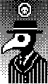

# nice-view-mod
A customized fork of the [nice-view-mod](https://github.com/GPeye/nice-view-mod) for inclusion as its own ZMK module into customized ZMK build configs to display this custom animation:



The contents of the the `boards/shields/nice_view_custom` folder should be identical to the upstream https://github.com/zmkfirmware/zmk/blob/main/app/boards/shields/nice_view, except for:

- The `nice_view.*` files which are renamed to `nice_view_custom.*`
- The references to `nice_view` as `nice_view_custom` in the `Kconfig.devconfig` and `Kconfig.shield` files
- The customizations to the `widgets/art.c` and `widgets/peripheral_status.c` files

As provided, it should function exactly like the current nice!view shield present in the ZMK firmware.

For a complete example of forking and editing this repo to make a custom nice_view shield with custom animations, check out [https://github.com/GPeye/urchin-peripheral-animation](https://github.com/GPeye/urchin-peripheral-animation)

## Usage

To use this module, first add it to your config/west.yml by adding a new entry to remotes and projects:

```yml
manifest:
  remotes:
      # zmk official
    - name: zmkfirmware
      url-base: https://github.com/zmkfirmware
    - name: leetmeister                         #new entry
      url-base: https://github.com/leetmeister  #new entry
  projects:
    - name: zmk
      remote: zmkfirmware
      revision: main
      import: app/west.yml
    - name: nice-view-mod                       #new entry
      remote: leetmeister                       #new entry
      revision: main                            #new entry
  self:
    path: config
```

Now simply swap out the default nice_view shield on the board for the custom one in your build.yaml file.

```yml
---
include:
  - board: nice_nano_v2
    shield: urchin_left nice_view_adapter  nice_view_custom #custom shield
  - board: nice_nano_v2
    shield: urchin_right nice_view_adapter nice_view_custom #custom shield
```
